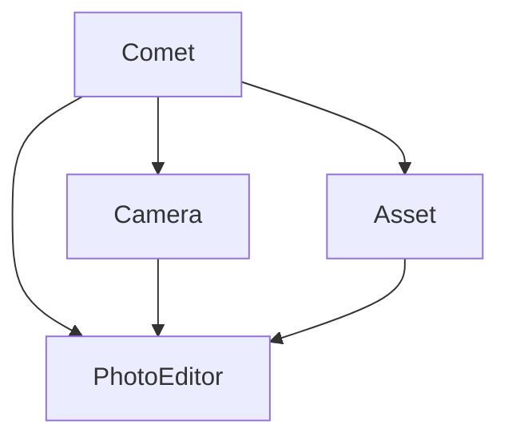

# Comet 项目 Code Wiki

## 1. 项目概述

Comet 是一个 iOS 相机、图片编辑和相册访问的综合解决方案，提供了完整的相机功能、图片编辑能力和相册管理功能。

### 1.1 项目结构

```
Comet/
├── Sources/
│   ├── Comet/           # 主库，集成所有子库
│   ├── Camera/          # 相机功能模块
│   ├── PhotoEditor/     # 图片编辑模块
│   ├── Asset/           # 相册访问模块
│   └── Log/             # 日志模块
├── CometDemo/           # 演示应用
├── Comet Camera/        # 相机应用
├── Tests/               # 测试代码
├── Package.swift        # Swift 包配置
└── README.md            # 项目说明
```

### 1.2 技术栈

- **语言**: Swift 6.0
- **平台**: iOS 15.0+
- **核心框架**: AVFoundation, Photos, CoreImage
- **UI框架**: UIKit, SwiftUI
- **渲染技术**: Metal (用于滤镜和图像处理)

## 2. 项目架构

Comet 采用模块化设计，将功能划分为三个核心子库，每个子库负责特定的功能领域，主库 Comet 集成了所有子库的功能。

### 2.1 模块依赖关系



### 2.2 核心模块职责

| 模块 | 主要职责 | 文件位置 | 引用 |
|------|---------|---------|------|
| Comet | 集成所有子库，提供统一接口 | Sources/Comet/ | [Comet.swift](file:///Users/zhuangxiaowei/Projects/Comet/Sources/Comet/Comet.swift) |
| Camera | 相机功能，包括拍照、对焦、变焦、滤镜等 | Sources/Camera/ | [CMCamera.swift](file:///Users/zhuangxiaowei/Projects/Comet/Sources/Camera/CMCamera.swift) |
| PhotoEditor | 图片编辑功能，包括裁剪、滤镜、调整等 | Sources/PhotoEditor/ | [CMPhotoEditor.swift](file:///Users/zhuangxiaowei/Projects/Comet/Sources/PhotoEditor/Core/CMPhotoEditor.swift) |
| Asset | 相册访问功能，包括获取相册、图片等 | Sources/Asset/ | [CMAssetManager.swift](file:///Users/zhuangxiaowei/Projects/Comet/Sources/Asset/Core/CMAssetManager.swift) |

## 3. 主要模块详解

### 3.1 Camera 模块

#### 3.1.1 核心类

| 类名 | 职责 | 文件位置 | 引用 |
|------|------|---------|------|
| CMCamera | 相机核心类，处理相机初始化、配置、拍照等 | Sources/Camera/ | [CMCamera.swift](file:///Users/zhuangxiaowei/Projects/Comet/Sources/Camera/CMCamera.swift) |
| CMCameraFilterPipeline | 相机滤镜管道，管理滤镜应用 | Sources/Camera/Model/ | [CMCameraFilterPipeline.swift](file:///Users/zhuangxiaowei/Projects/Comet/Sources/Camera/Model/CMCameraFilterPipeline.swift) |
| CMMetalFilterProcessor | Metal 滤镜处理器，应用滤镜效果 | Sources/Camera/Metal/ | [CMMetalFilterProcessor.swift](file:///Users/zhuangxiaowei/Projects/Comet/Sources/Camera/Metal/CMMetalFilterProcessor.swift) |

#### 3.1.2 关键函数

| 函数名 | 描述 | 参数 | 返回值 | 引用 |
|--------|------|------|--------|------|
| start() | 启动相机会话 | 无 | 无 | [CMCamera.swift](file:///Users/zhuangxiaowei/Projects/Comet/Sources/Camera/CMCamera.swift#L59-L64) |
| stop() | 停止相机会话 | 无 | 无 | [CMCamera.swift](file:///Users/zhuangxiaowei/Projects/Comet/Sources/Camera/CMCamera.swift#L67-L72) |
| setFocus(_:) | 设置相机焦点 | point: CGPoint | 无 | [CMCamera.swift](file:///Users/zhuangxiaowei/Projects/Comet/Sources/Camera/CMCamera.swift#L74-L99) |
| setZoomFactor(_:rampDuration:) | 设置相机变焦 | factor: CGFloat, rampDuration: TimeInterval | 无 | [CMCamera.swift](file:///Users/zhuangxiaowei/Projects/Comet/Sources/Camera/CMCamera.swift#L101-L129) |
| switchCamera() | 切换前后相机 | 无 | Result<Void, CMCameraError> | [CMCamera.swift](file:///Users/zhuangxiaowei/Projects/Comet/Sources/Camera/CMCamera.swift#L161-L186) |
| switchLens(to:) | 切换镜头 | lens: LensType | Result<Void, CMCameraError> | [CMCamera.swift](file:///Users/zhuangxiaowei/Projects/Comet/Sources/Camera/CMCamera.swift#L189-L254) |
| takePhoto() | 拍照 | 无 | CMPhoto? | [CMCamera.swift](file:///Users/zhuangxiaowei/Projects/Comet/Sources/Camera/CMCamera.swift#L257-L285) |
| applyFilters(to:filters:) | 应用滤镜到像素缓冲区 | pixelBuffer: CVPixelBuffer, filters: [CMCameraFilter] | CVPixelBuffer | [CMCamera.swift](file:///Users/zhuangxiaowei/Projects/Comet/Sources/Camera/CMCamera.swift#L311-L313) |

### 3.2 PhotoEditor 模块

#### 3.2.1 核心类

| 类名 | 职责 | 文件位置 | 引用 |
|------|------|---------|------|
| CMPhotoEditor | 图片编辑入口类 | Sources/PhotoEditor/Core/ | [CMPhotoEditor.swift](file:///Users/zhuangxiaowei/Projects/Comet/Sources/PhotoEditor/Core/CMPhotoEditor.swift) |
| CMPhotoEditorEngine | 图片编辑引擎，执行编辑操作 | Sources/PhotoEditor/Core/ | [CMPhotoEditorEngine.swift](file:///Users/zhuangxiaowei/Projects/Comet/Sources/PhotoEditor/Core/CMPhotoEditorEngine.swift) |
| CMPhotoEditOperation | 图片编辑操作基类 | Sources/PhotoEditor/Core/ | [CMPhotoEditOperation.swift](file:///Users/zhuangxiaowei/Projects/Comet/Sources/PhotoEditor/Core/CMPhotoEditOperation.swift) |

#### 3.2.2 编辑操作

| 操作类 | 职责 | 文件位置 | 引用 |
|--------|------|---------|------|
| CMCropOperation | 裁剪操作 | Sources/PhotoEditor/Operations/ | [CMCropOperation.swift](file:///Users/zhuangxiaowei/Projects/Comet/Sources/PhotoEditor/Operations/CMCropOperation.swift) |
| CMFilterOperation | 滤镜操作 | Sources/PhotoEditor/Operations/ | [CMFilterOperation.swift](file:///Users/zhuangxiaowei/Projects/Comet/Sources/PhotoEditor/Operations/CMFilterOperation.swift) |
| CMColorAdjustOperation | 色彩调整操作 | Sources/PhotoEditor/Operations/ | [CMColorAdjustOperation.swift](file:///Users/zhuangxiaowei/Projects/Comet/Sources/PhotoEditor/Operations/CMColorAdjustOperation.swift) |
| CMBackgroundRemovalOperation | 背景移除操作 | Sources/PhotoEditor/Operations/ | [CMBackgroundRemovalOperation.swift](file:///Users/zhuangxiaowei/Projects/Comet/Sources/PhotoEditor/Operations/CMBackgroundRemovalOperation.swift) |
| CMMosaicOperation | 马赛克操作 | Sources/PhotoEditor/Operations/ | [CMMosaicOperation.swift](file:///Users/zhuangxiaowei/Projects/Comet/Sources/PhotoEditor/Operations/CMMosaicOperation.swift) |
| CMTextOverlayOperation | 文本叠加操作 | Sources/PhotoEditor/Operations/ | [CMTextOverlayOperation.swift](file:///Users/zhuangxiaowei/Projects/Comet/Sources/PhotoEditor/Operations/CMTextOverlayOperation.swift) |
| CMWatermarkOverlayOperation | 水印叠加操作 | Sources/PhotoEditor/Operations/ | [CMWatermarkOverlayOperation.swift](file:///Users/zhuangxiaowei/Projects/Comet/Sources/PhotoEditor/Operations/CMWatermarkOverlayOperation.swift) |
| CMWatermarkRemovalOperation | 水印移除操作 | Sources/PhotoEditor/Operations/ | [CMWatermarkRemovalOperation.swift](file:///Users/zhuangxiaowei/Projects/Comet/Sources/PhotoEditor/Operations/CMWatermarkRemovalOperation.swift) |

### 3.3 Asset 模块

#### 3.3.1 核心类

| 类名 | 职责 | 文件位置 | 引用 |
|------|------|---------|------|
| CMAssetManager | 相册管理类，处理相册访问和操作 | Sources/Asset/Core/ | [CMAssetManager.swift](file:///Users/zhuangxiaowei/Projects/Comet/Sources/Asset/Core/CMAssetManager.swift) |
| CMAssetLoader | 资产加载器，加载图片资源 | Sources/Asset/Core/ | [CMAssetLoader.swift](file:///Users/zhuangxiaowei/Projects/Comet/Sources/Asset/Core/CMAssetLoader.swift) |
| CMAsset | 资产模型，封装 PHAsset | Sources/Asset/Models/ | [CMAsset.swift](file:///Users/zhuangxiaowei/Projects/Comet/Sources/Asset/Models/CMAsset.swift) |
| CMAssetCollection | 相册模型，封装 PHAssetCollection | Sources/Asset/Models/ | [CMAssetCollection.swift](file:///Users/zhuangxiaowei/Projects/Comet/Sources/Asset/Models/CMAssetCollection.swift) |
| CMAssetCursor | 图片游标，用于高效获取大量图片 | Sources/Asset/Core/ | [CMAssetManager.swift](file:///Users/zhuangxiaowei/Projects/Comet/Sources/Asset/Core/CMAssetManager.swift#L138-L181) |

#### 3.3.2 关键函数

| 函数名 | 描述 | 参数 | 返回值 | 引用 |
|--------|------|------|--------|------|
| requestPermission() | 请求相册访问权限 | 无 | Bool | [CMAssetManager.swift](file:///Users/zhuangxiaowei/Projects/Comet/Sources/Asset/Core/CMAssetManager.swift#L15-L21) |
| getAlbums() | 获取所有相册列表 | 无 | [CMAssetCollection] | [CMAssetManager.swift](file:///Users/zhuangxiaowei/Projects/Comet/Sources/Asset/Core/CMAssetManager.swift#L31-L57) |
| createAlbum(title:) | 创建新相册 | title: String | CMAssetCollection | [CMAssetManager.swift](file:///Users/zhuangxiaowei/Projects/Comet/Sources/Asset/Core/CMAssetManager.swift#L62-L86) |
| deleteAlbum(_:) | 删除相册 | album: CMAssetCollection | Bool | [CMAssetManager.swift](file:///Users/zhuangxiaowei/Projects/Comet/Sources/Asset/Core/CMAssetManager.swift#L91-L107) |
| getAssets(in:) | 获取指定相册下的图片 | album: CMAssetCollection | Void | [CMAssetManager.swift](file:///Users/zhuangxiaowei/Projects/Comet/Sources/Asset/Core/CMAssetManager.swift#L112-L122) |
| getAssetCursor(in:batchSize:) | 获取图片游标 | album: CMAssetCollection, batchSize: Int | CMAssetCursor | [CMAssetManager.swift](file:///Users/zhuangxiaowei/Projects/Comet/Sources/Asset/Core/CMAssetManager.swift#L129-L134) |

## 4. 项目运行方式

### 4.1 集成方式

#### 4.1.1 Swift Package Manager

在 `Package.swift` 文件中添加依赖：

```swift
dependencies: [
    .package(url: "https://github.com/yourusername/Comet.git", from: "1.0.0")
]
```

然后在目标中添加需要的模块：

```swift
targets: [
    .target(
        name: "YourApp",
        dependencies: [
            .product(name: "Comet", package: "Comet"),
            // 或单独使用子模块
            // .product(name: "Camera", package: "Comet"),
            // .product(name: "PhotoEditor", package: "Comet"),
            // .product(name: "Asset", package: "Comet"),
        ]
    )
]
```

### 4.2 示例代码

#### 4.2.1 使用相机

```swift
import Camera

let camera = CMCamera()

// 启动相机
camera.start()

// 设置焦点
camera.setFocus(CGPoint(x: 0.5, y: 0.5))

// 设置变焦
camera.setZoomFactor(2.0)

// 切换相机
camera.switchCamera()

// 拍照
if let photo = await camera.takePhoto() {
    // 处理照片
}

// 停止相机
camera.stop()
```

#### 4.2.2 使用图片编辑

```swift
import PhotoEditor

// 创建编辑操作
let operations: [CMPhotoEditOperation] = [
    CMCropOperation(rect: CGRect(x: 0, y: 0, width: 100, height: 100)),
    CMFilterOperation(filter: CMPhotoEditorFilter(name: "CIPhotoEffectMono"))
]

// 执行编辑
if let editedImage = try? CMPhotoEditor.edit(originalImage, operations: operations) {
    // 处理编辑后的图片
}
```

#### 4.2.3 使用相册访问

```swift
import Asset

let assetManager = CMAssetManager.shared

// 请求权限
let hasPermission = await assetManager.requestPermission()

if hasPermission {
    // 获取相册列表
    let albums = try? await assetManager.getAlbums()
    
    if let firstAlbum = albums?.first {
        // 获取相册中的图片
        try? await assetManager.getAssets(in: firstAlbum)
        
        // 或使用游标获取大量图片
        let cursor = assetManager.getAssetCursor(in: firstAlbum, batchSize: 50)
        while cursor.hasMore {
            let assets = cursor.nextBatch()
            // 处理图片
        }
    }
}
```

## 5. 项目配置与依赖

### 5.1 Package.swift 配置

```swift
// swift-tools-version: 6.0
import PackageDescription

let package = Package(
    name: "Comet",
    platforms: [.iOS(.v15)],
    products: [
        .library(
            name: "Comet",
            targets: ["Comet"]),
        .library(
            name: "Camera",
            targets: ["Camera"]),
        .library(
            name: "PhotoEditor",
            targets: ["PhotoEditor"]),
        .library(
            name: "Asset",
            targets: ["Asset"]),
        .executable(name: "CometDemo", targets: ["CometDemo"]),
    ],
    targets: [
        .target(
            name: "Comet", dependencies: ["Camera", "PhotoEditor", "Asset"]),
        .target(
            name: "Camera", dependencies: ["PhotoEditor"], path: "Sources/Camera", resources: [.process("Res")]),
        .target(
            name: "PhotoEditor", path: "Sources/PhotoEditor"),
        .target(
            name: "Asset", dependencies: ["PhotoEditor"], path: "Sources/Asset", resources: [.process("Res")]),
        .executableTarget(name: "CometDemo", dependencies: ["Comet"], path: "CometDemo/CometDemo"),
        .testTarget(
            name: "PhotoEditorTests",
            dependencies: ["PhotoEditor"],
            path: "Tests/PhotoEditorTests"
        ),
    ],
    swiftLanguageModes: [.v5]
)
```

### 5.2 系统权限需求

| 权限 | 用途 | 模块 | 引用 |
|------|------|------|------|
| 相机权限 | 访问相机 | Camera | [CMCamera.swift](file:///Users/zhuangxiaowei/Projects/Comet/Sources/Camera/CMCamera.swift) |
| 麦克风权限 | 录制视频时使用 | Camera | [CMCamera.swift](file:///Users/zhuangxiaowei/Projects/Comet/Sources/Camera/CMCamera.swift#L709-L722) |
| 相册权限 | 访问和修改相册 | Asset | [CMAssetManager.swift](file:///Users/zhuangxiaowei/Projects/Comet/Sources/Asset/Core/CMAssetManager.swift#L15-L21) |

## 6. 关键功能与技术亮点

### 6.1 相机功能

- **多镜头支持**: 支持超广角、广角和长焦镜头切换
- **实时滤镜**: 使用 Metal 实现高性能实时滤镜
- **自动对焦**: 支持点击屏幕自动对焦
- **平滑变焦**: 支持平滑的变焦动画
- **前后相机切换**: 支持前后相机快速切换

### 6.2 图片编辑功能

- **丰富的编辑操作**: 支持裁剪、滤镜、色彩调整、背景移除、马赛克、文本叠加、水印等多种编辑操作
- **Metal 加速**: 使用 Metal 实现高性能图像处理
- **操作链式处理**: 支持多个编辑操作的链式处理
- **敏感信息检测**: 支持检测和处理敏感信息

### 6.3 相册访问功能

- **权限管理**: 自动处理相册访问权限
- **相册管理**: 支持获取、创建、删除相册
- **高效加载**: 使用游标机制高效加载大量图片
- **智能排序**: 默认按创建日期降序排序图片

## 7. 测试与验证

项目包含完整的测试套件，主要测试图片编辑功能：

| 测试文件 | 测试内容 | 文件位置 | 引用 |
|---------|---------|---------|------|
| CMCropStateTests.swift | 裁剪状态测试 | Tests/PhotoEditorTests/ | [CMCropStateTests.swift](file:///Users/zhuangxiaowei/Projects/Comet/Tests/PhotoEditorTests/CMCropStateTests.swift) |
| CMMosaicOperationTests.swift | 马赛克操作测试 | Tests/PhotoEditorTests/ | [CMMosaicOperationTests.swift](file:///Users/zhuangxiaowei/Projects/Comet/Tests/PhotoEditorTests/CMMosaicOperationTests.swift) |
| CMOverlayAndFilterTests.swift | 叠加和滤镜测试 | Tests/PhotoEditorTests/ | [CMOverlayAndFilterTests.swift](file:///Users/zhuangxiaowei/Projects/Comet/Tests/PhotoEditorTests/CMOverlayAndFilterTests.swift) |
| CMPhotoEditorEngineTests.swift | 图片编辑引擎测试 | Tests/PhotoEditorTests/ | [CMPhotoEditorEngineTests.swift](file:///Users/zhuangxiaowei/Projects/Comet/Tests/PhotoEditorTests/CMPhotoEditorEngineTests.swift) |
| CMSensitiveTextPatternMatcherTests.swift | 敏感文本匹配测试 | Tests/PhotoEditorTests/ | [CMSensitiveTextPatternMatcherTests.swift](file:///Users/zhuangxiaowei/Projects/Comet/Tests/PhotoEditorTests/CMSensitiveTextPatternMatcherTests.swift) |

## 8. 未来发展方向

1. **增强 AI 功能**: 集成更多 AI 驱动的功能，如智能场景识别、自动美化等
2. **扩展平台支持**: 考虑支持 macOS、iPadOS 等其他 Apple 平台
3. **添加视频编辑**: 扩展功能以支持视频拍摄和编辑
4. **优化性能**: 进一步优化 Metal 渲染性能，支持更复杂的滤镜效果
5. **增强用户界面**: 提供更多预设和用户友好的编辑界面

## 9. 总结

Comet 是一个功能完整、架构清晰的 iOS 多媒体处理框架，提供了相机、图片编辑和相册访问的综合解决方案。通过模块化设计和 Metal 加速，它实现了高性能的图像处理和流畅的用户体验。

该项目适合需要集成相机功能、图片编辑能力或相册访问功能的 iOS 应用，可根据需求单独使用各个子模块，也可以使用完整的 Comet 库。

---

**文档版本**: 1.0.0
**更新日期**: 2026-04-14